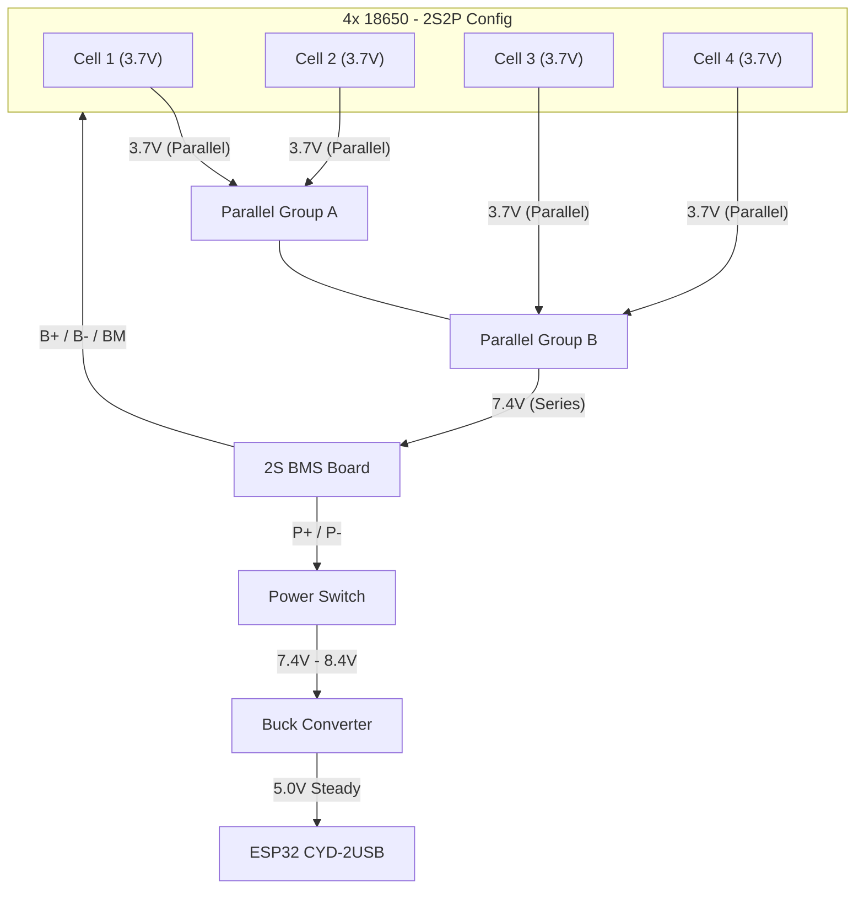

# Willy 2.1 Hardware Setup Guide - Battery & Power

This guide explains how to properly power your Willy device using a high-capacity 18650 battery bank.

## Components Needed

1. **4x 18650 Batteries** (preferably high-quality cells like LG HG2 or Samsung 25R).
2. **2S BMS (Battery Management System)**: Rated for at least 5-10A.
3. **Buck Converter (Step-Down)**: To convert 8.4V (full charge) to steady 5V for the ESP32.
4. **DC Switch**: For physical power control.

## Wiring Schematic

## Important Safety Notes
>
> [!WARNING]
> **2S Setup (7.4V)**: You MUST use a 2S BMS. A 1S BMS will not work and could be dangerous for this voltage.
> **Buck Converter**: Do NOT connect the 8.4V directly to the ESP32 5V pin. You will fry the board. Always use a buck converter.

## Configuration in Firmware

The `getBattery()` function in `utils.cpp` is calibrated for a voltage divider.
Ensure your voltage divider is connected to the BMS output (before the buck converter) and scaled appropriately for the ESP32 (0-3.3V).

### Typical Voltage Divider for 2S (8.4V max)

- R1: 10k
- R2: 4.7k
- Ratio: 0.32
- 8.4V * 0.32 = 2.68V (Safe for ESP32 ADC)
